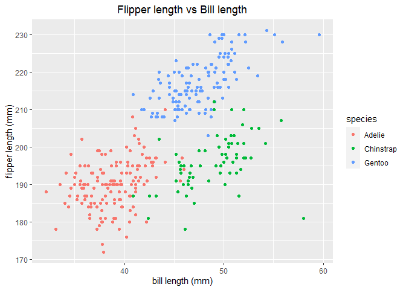

p8105\_hw1\_wc2750
================
Weixi Chen
9/17/2020

## Problem 1

### Create a data frame

``` r
# create variables
vec_sample = rnorm (10) # a random sample of size 10 from a standard Normal distribution
vec_logical = vec_sample > 0 # a logical vector indicating whether elements of the sample are greater then 0
vec_char = c ("Hi", "my", "name", "is", "Weixi", "Chen", "nice", "to", "meet", "you") # a character vector of length 10
vec_factor = factor(c("low", "low", "low", "medium", "medium", "medium", "medium", "high", "high", "high")) # a factor vector of length 10, with 3 different factor “levels”

# create a data frame using tibble()
library(tibble)
data_frame = tibble(
  vec_sample,
  vec_logical,
  vec_char,
  vec_factor
)
data_frame
```

    ## # A tibble: 10 x 4
    ##    vec_sample vec_logical vec_char vec_factor
    ##         <dbl> <lgl>       <chr>    <fct>     
    ##  1     1.83   TRUE        Hi       low       
    ##  2     0.489  TRUE        my       low       
    ##  3     0.0294 TRUE        name     low       
    ##  4     1.30   TRUE        is       medium    
    ##  5    -0.305  FALSE       Weixi    medium    
    ##  6    -0.467  FALSE       Chen     medium    
    ##  7    -1.48   FALSE       nice     medium    
    ##  8    -1.75   FALSE       to       high      
    ##  9     1.94   TRUE        meet     high      
    ## 10     0.0665 TRUE        you      high

### Apply as.numeric function

``` r
# apply as.numeric
as.numeric (vec_logical)
as.numeric (vec_char)
as.numeric (vec_factor)
```

### Convert variables

``` r
as.numeric (vec_logical) * vec_sample
##  [1] 1.83085669 0.48904726 0.02938639 1.29832966 0.00000000 0.00000000
##  [7] 0.00000000 0.00000000 1.93951103 0.06649331
as.factor (vec_logical) * vec_sample
## Warning in Ops.factor(as.factor(vec_logical), vec_sample): '*' not meaningful
## for factors
##  [1] NA NA NA NA NA NA NA NA NA NA
as.numeric (as.factor (vec_logical)) * vec_sample
##  [1]  3.66171338  0.97809453  0.05877278  2.59665931 -0.30480773 -0.46682065
##  [7] -1.47869966 -1.75160615  3.87902206  0.13298662
```

## Problem 2

### Make a plot for “penguins” dataset

``` r
# load "penguins" dataset
data("penguins", package = "palmerpenguins")
```

The “penguins” dataset shows the variables of species, island,
bill\_length\_mm, bill\_depth\_mm, flipper\_length\_mm, body\_mass\_g,
sex, year. The species include Adelie, Chinstrap, Gentoo from Biscoe,
Dream, Torgersen islands. The data comes from year 2007, 2008, 2009. The
bill length ranges from 32.1mm to 59.6mm. The bill depth ranges from
13.1mm to 21.5mm. The flipper length ranges from 172mm to 231mm. And the
body mass ranges from 2700g to 6300g.

The dataset has 344 rows and 8 columns.

The mean flipper length is 200.92mm (NA excluded).

``` r
# load tidyverse packages
library(tidyverse)
```

    ## -- Attaching packages -------------------------------------------- tidyverse 1.3.0 --

    ## v ggplot2 3.3.2     v dplyr   1.0.2
    ## v tidyr   1.1.2     v stringr 1.4.0
    ## v readr   1.3.1     v forcats 0.5.0
    ## v purrr   0.3.4

    ## -- Conflicts ----------------------------------------------- tidyverse_conflicts() --
    ## x dplyr::filter() masks stats::filter()
    ## x dplyr::lag()    masks stats::lag()

``` r
# make a scatterplot of flipper length (y) vs bill length (x)
plot_penguins = tibble(
  x = penguins$bill_length_mm, 
  y = penguins$flipper_length_mm)
# plot flipper length (y) vs bill length (x), colored by species
ggplot(plot_penguins, aes(x = x, y = y, color = penguins$species)) + geom_point() + labs (color = "species", x = "bill length (mm)", y = "flipper length (mm)", title = "Flipper length vs Bill length" ) + theme(plot.title = element_text(hjust = 0.5))
```

<!-- -->

``` r
# save the plot
ggsave("flipper_vs_bill.pdf")
```

    ## Saving 7 x 5 in image
